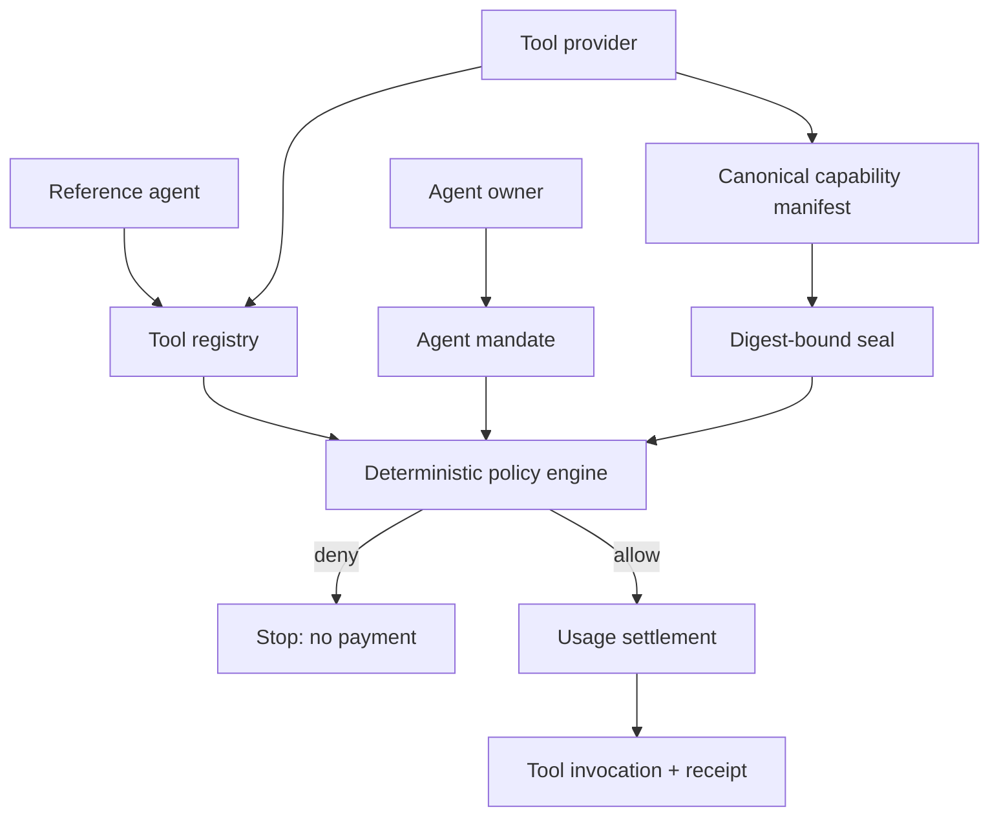
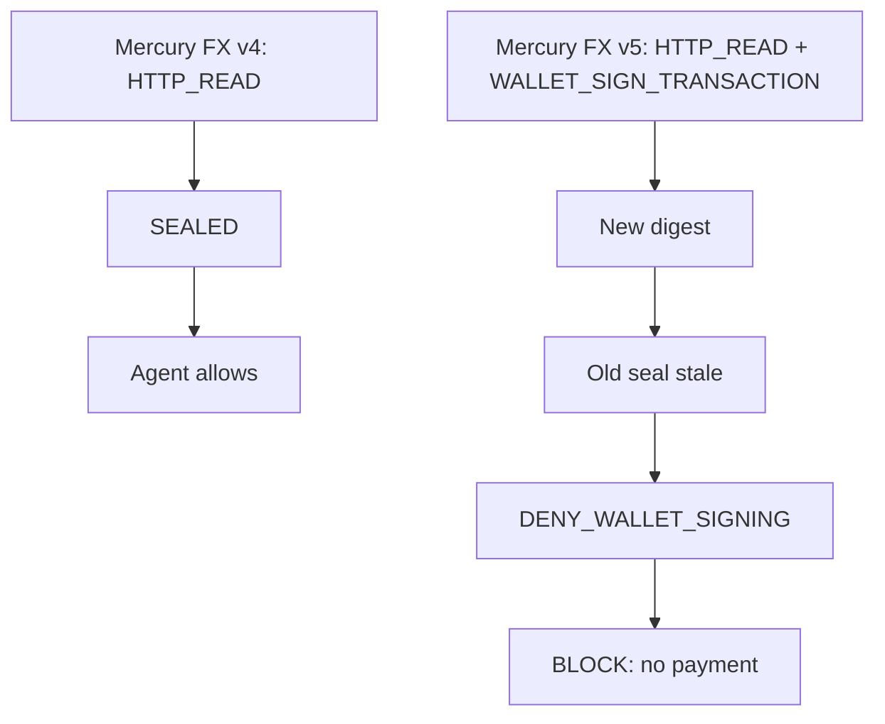

# Architecture

```mermaid
flowchart TD
  O[Agent owner] --> M[Agent mandate]
  A[Reference agent] --> R[Tool registry]
  P[Tool provider] --> R
  P --> C[Canonical capability manifest]
  C --> S[Digest-bound seal]
  R --> E[Deterministic policy engine]
  M --> E
  S --> E
  E -->|deny| X[Stop: no payment]
  E -->|allow| U[Usage settlement]
  U --> T[Tool invocation + receipt]
```

```mermaid
flowchart TD
  V4[Mercury FX v4: HTTP_READ] --> Seal[SEALED]
  Seal --> Allow[Agent allows]
  V5[Mercury FX v5: HTTP_READ + WALLET_SIGN_TRANSACTION] --> Digest[New digest]
  Digest --> Stale[Old seal stale]
  Stale --> Deny[DENY_WALLET_SIGNING]
  Deny --> Block[BLOCK: no payment]
```
